# <span style="color:red"> FOREST FIRES IN BRAZIL </span>

See <https://www.kaggle.com/gustavomodelli/forest-fires-in-brazil> for a full description of the dataset.

Import packages


```python
%matplotlib notebook
%matplotlib inline
import pandas as pd #Handle datasets
import seaborn as sns #Plots
import matplotlib.pyplot as plt  #Plots

#Set some graphical parameters
rc={'axes.labelsize': 25, 'figure.figsize': (20,10), 
    'axes.titlesize': 25, 'xtick.labelsize': 18, 'ytick.labelsize': 18}
sns.set(rc=rc)

#Path data
path = 'C:/Users/Angela Andreella/Documents/Conference_Talk/Python_Psicostat1/Data'
df = pd.read_csv(path + '/amazon.csv')
```

First $3$ observations:


```python
df.head(n=3)
```


<div>
<style scoped>
    .dataframe tbody tr th:only-of-type {
        vertical-align: middle;
    }

    .dataframe tbody tr th {
        vertical-align: top;
    }

    .dataframe thead th {
        text-align: right;
    }
</style>
<table border="1" class="dataframe">
  <thead>
    <tr style="text-align: right;">
      <th></th>
      <th>year</th>
      <th>state</th>
      <th>month</th>
      <th>number</th>
      <th>date</th>
    </tr>
  </thead>
  <tbody>
    <tr>
      <th>0</th>
      <td>1998</td>
      <td>Acre</td>
      <td>Janeiro</td>
      <td>0.0</td>
      <td>1998-01-01</td>
    </tr>
    <tr>
      <th>1</th>
      <td>1999</td>
      <td>Acre</td>
      <td>Janeiro</td>
      <td>0.0</td>
      <td>1999-01-01</td>
    </tr>
    <tr>
      <th>2</th>
      <td>2000</td>
      <td>Acre</td>
      <td>Janeiro</td>
      <td>0.0</td>
      <td>2000-01-01</td>
    </tr>
  </tbody>
</table>
</div>


Some **information** about the variables:


```python
df.info() 
```

    <class 'pandas.core.frame.DataFrame'>
    RangeIndex: 6454 entries, 0 to 6453
    Data columns (total 5 columns):
    year      6454 non-null int64
    state     6454 non-null object
    month     6454 non-null object
    number    6454 non-null float64
    date      6454 non-null object
    dtypes: float64(1), int64(1), object(3)
    memory usage: 252.2+ KB
    

We are interested about the **number of forest fires** in Brazil


```python
df.number.describe()
```


    count    6454.000000
    mean      108.293163
    std       190.812242
    min         0.000000
    25%         3.000000
    50%        24.000000
    75%       113.000000
    max       998.000000
    Name: number, dtype: float64


To have an simple plot, we take a subset of the dataset:


```python
df1 = df[(df.year > 2010) & (df.year < 2019)]
df1 =df1.loc[(df1.state.str.startswith('M'))]
```

We do a **boxplot** about the number of fire by groups, i.e., the **states** and the **years**.


```python
sns.boxplot(x = 'year', y = 'number', hue = "state", data = df1) 
```


    <matplotlib.axes._subplots.AxesSubplot at 0x4ccdfa90>


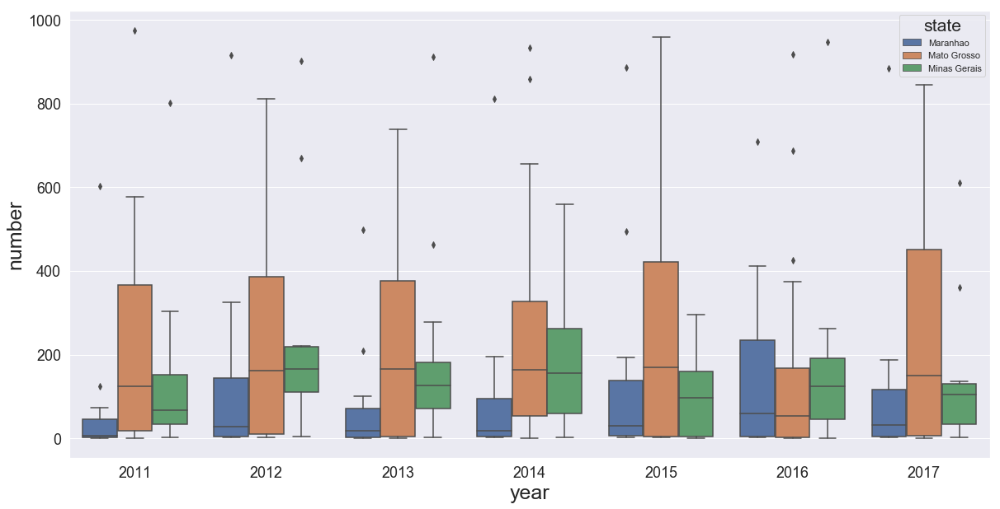


We do a **timeseries plot with error bands**:


```python
sns.lineplot(x="year", y="number",hue="state", data=df1)

```


    <matplotlib.axes._subplots.AxesSubplot at 0x4d887c88>


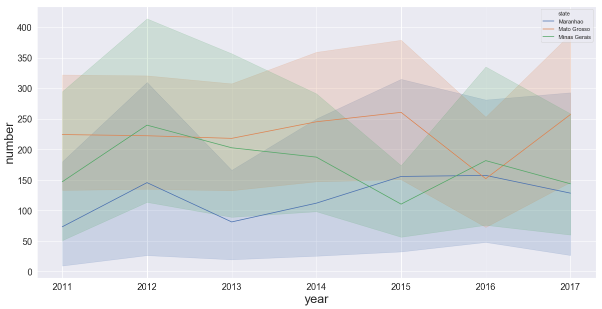


also we do a **grouped violinplots**:


```python
sns.violinplot(x="state", y="number", data=df1)  
```


    <matplotlib.axes._subplots.AxesSubplot at 0x4d9a26a0>


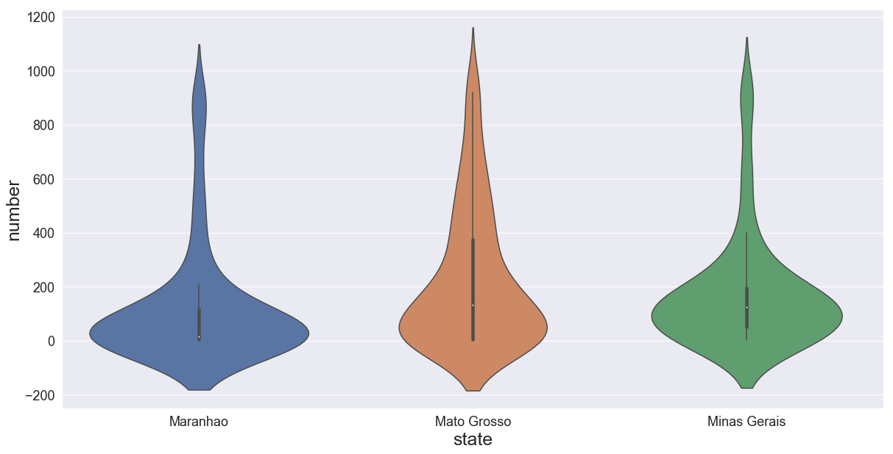


For other plots, please see <https://seaborn.pydata.org/examples/index.html>.

# <span style="color:red"> ECONOMIC FREEDOM INDEX</span>

See <https://www.kaggle.com/lewisduncan93/the-economic-freedom-index> for a full description of the dataset.

Load and preprocess data


```python
dt = pd.read_csv(path + '/economic_freedom_index2019_data.csv')
dt.columns = dt.columns.str.replace(' ', '')
dt.columns = dt.columns.str.replace('2019', '')
dt.columns = dt.columns.str.replace('%', '')
dt.columns = dt.columns.str.replace('(', '')
dt.columns = dt.columns.str.replace(')', '')
dt = dt.dropna(axis = 0,how='any')
```

Basic info 


```python
dt.info()
```

    <class 'pandas.core.frame.DataFrame'>
    Int64Index: 173 entries, 0 to 185
    Data columns (total 34 columns):
    CountryID                173 non-null int64
    CountryName              173 non-null object
    WEBNAME                  173 non-null object
    Region                   173 non-null object
    WorldRank                173 non-null float64
    RegionRank               173 non-null float64
    Score                    173 non-null float64
    PropertyRights           173 non-null float64
    JudicalEffectiveness     173 non-null float64
    GovernmentIntegrity      173 non-null float64
    TaxBurden                173 non-null float64
    Gov'tSpending            173 non-null float64
    FiscalHealth             173 non-null float64
    BusinessFreedom          173 non-null float64
    LaborFreedom             173 non-null float64
    MonetaryFreedom          173 non-null float64
    TradeFreedom             173 non-null float64
    InvestmentFreedom        173 non-null float64
    FinancialFreedom         173 non-null float64
    TariffRate               173 non-null float64
    IncomeTaxRate            173 non-null float64
    CorporateTaxRate         173 non-null float64
    TaxBurdenofGDP           173 non-null float64
    Gov'tExpenditureofGDP    173 non-null float64
    Country                  173 non-null object
    PopulationMillions       173 non-null object
    GDPBillions,PPP          173 non-null object
    GDPGrowthRate            173 non-null float64
    5YearGDPGrowthRate       173 non-null float64
    GDPperCapitaPPP          173 non-null object
    Unemployment             173 non-null object
    Inflation                173 non-null float64
    FDIInflowMillions        173 non-null object
    PublicDebtofGDP          173 non-null float64
    dtypes: float64(24), int64(1), object(9)
    memory usage: 47.3+ KB
    

## <span style="color:blue"> Some plots </span>

Boxplot by group, i.e. **region**:


```python
sns.boxplot(x = 'Region', y = 'Score', data = dt) 
```


    <matplotlib.axes._subplots.AxesSubplot at 0x4dc85eb8>


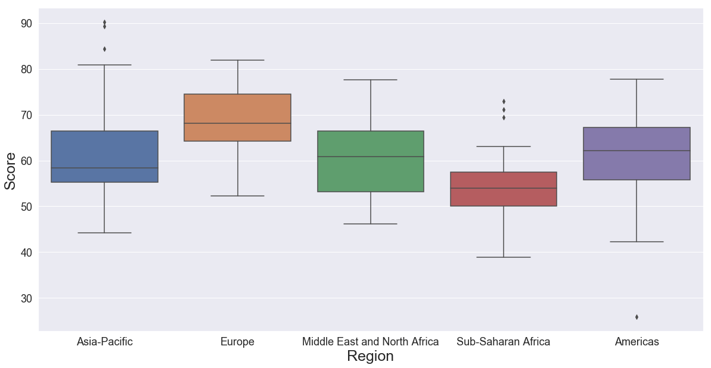


First **scatter plot**:


```python
plt.scatter(x="PropertyRights", y="Score", data=dt)
```


    <matplotlib.collections.PathCollection at 0x4bff0c18>


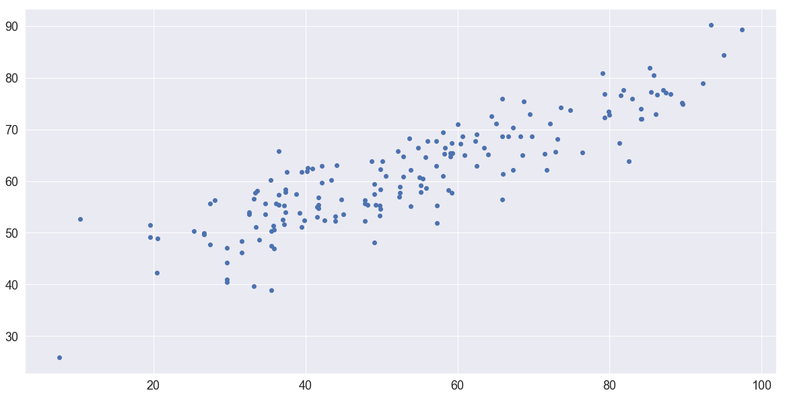


We can put directly the **linear regression fitting**:


```python
sns.lmplot(x="PropertyRights", y="Score", data=dt)
```


    <seaborn.axisgrid.FacetGrid at 0x4ddbc710>


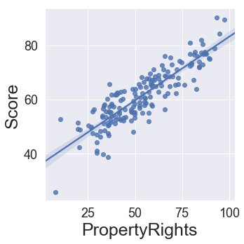


Density plot of the **score** variable:


```python
sns.distplot(dt.Score, color="r")
```


    <matplotlib.axes._subplots.AxesSubplot at 0x4df73fd0>


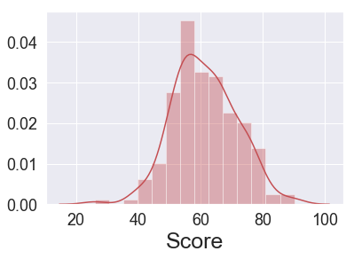


**Pair plot** considering some variables, i.e. Property Rights, Labor Freedom, Government Integrity, Judical Effectiveness, Fiscal Health, Region and Score:


```python
dt1 = dt[['PropertyRights', 'LaborFreedom', 'GovernmentIntegrity', 'JudicalEffectiveness','FiscalHealth', "Score", 'Region']]
```


```python
matplotlib.rc_file_defaults()
sns.pairplot(dt1, hue="Region")
```


    <seaborn.axisgrid.PairGrid at 0x4cbd9da0>


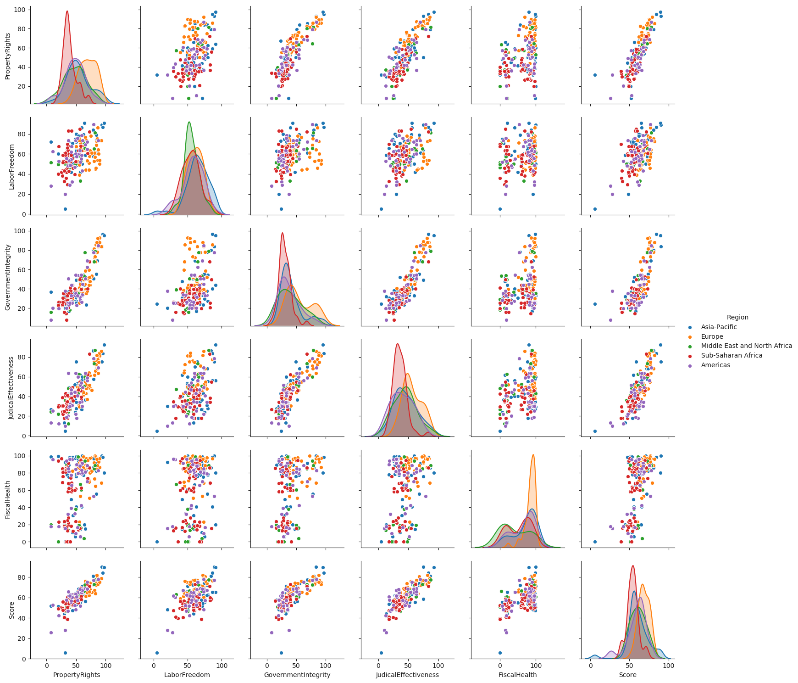


# <span style="color:blue"> Linear regression </span>

Import packages 


```python
import statsmodels.api as sm
import statsmodels.formula.api as smf
from sklearn.metrics import mean_squared_error
```

Correlation matrix


```python
corr = dt[['PropertyRights', 'LaborFreedom', 'GovernmentIntegrity', 'JudicalEffectiveness','FiscalHealth', "Score"]].corr()
corr
```


<div>
<style scoped>
    .dataframe tbody tr th:only-of-type {
        vertical-align: middle;
    }

    .dataframe tbody tr th {
        vertical-align: top;
    }

    .dataframe thead th {
        text-align: right;
    }
</style>
<table border="1" class="dataframe">
  <thead>
    <tr style="text-align: right;">
      <th></th>
      <th>PropertyRights</th>
      <th>LaborFreedom</th>
      <th>GovernmentIntegrity</th>
      <th>JudicalEffectiveness</th>
      <th>FiscalHealth</th>
      <th>Score</th>
    </tr>
  </thead>
  <tbody>
    <tr>
      <th>PropertyRights</th>
      <td>1.000000</td>
      <td>0.432746</td>
      <td>0.866998</td>
      <td>0.826805</td>
      <td>0.329969</td>
      <td>0.876601</td>
    </tr>
    <tr>
      <th>LaborFreedom</th>
      <td>0.432746</td>
      <td>1.000000</td>
      <td>0.413794</td>
      <td>0.421694</td>
      <td>0.104431</td>
      <td>0.512976</td>
    </tr>
    <tr>
      <th>GovernmentIntegrity</th>
      <td>0.866998</td>
      <td>0.413794</td>
      <td>1.000000</td>
      <td>0.888880</td>
      <td>0.292240</td>
      <td>0.818174</td>
    </tr>
    <tr>
      <th>JudicalEffectiveness</th>
      <td>0.826805</td>
      <td>0.421694</td>
      <td>0.888880</td>
      <td>1.000000</td>
      <td>0.287380</td>
      <td>0.805825</td>
    </tr>
    <tr>
      <th>FiscalHealth</th>
      <td>0.329969</td>
      <td>0.104431</td>
      <td>0.292240</td>
      <td>0.287380</td>
      <td>1.000000</td>
      <td>0.559395</td>
    </tr>
    <tr>
      <th>Score</th>
      <td>0.876601</td>
      <td>0.512976</td>
      <td>0.818174</td>
      <td>0.805825</td>
      <td>0.559395</td>
      <td>1.000000</td>
    </tr>
  </tbody>
</table>
</div>


Heatmap of the **correlation matrix**:


```python
sns.heatmap(corr, 
        xticklabels=corr.columns,
        yticklabels=corr.columns)
```


    <matplotlib.axes._subplots.AxesSubplot at 0x508b0a58>


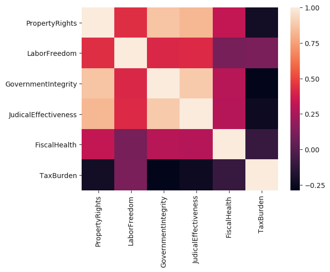


We split the dataset into training (0.8) and test set (0.2):


```python
msk = np.random.rand(len(dt)) < 0.8
train = dt[msk]
test = dt[~msk]
```

**Linear regression** having as dependent variable the **Score** and PropertyRights, LaborFreedom and FiscalHealth as explicative variables:


```python
results = smf.ols('Score ~ PropertyRights + LaborFreedom + FiscalHealth', data=train).fit()
results.summary()
```


<table class="simpletable">
<caption>OLS Regression Results</caption>
<tr>
  <th>Dep. Variable:</th>          <td>Score</td>      <th>  R-squared:         </th> <td>   0.883</td>
</tr>
<tr>
  <th>Model:</th>                   <td>OLS</td>       <th>  Adj. R-squared:    </th> <td>   0.880</td>
</tr>
<tr>
  <th>Method:</th>             <td>Least Squares</td>  <th>  F-statistic:       </th> <td>   335.6</td>
</tr>
<tr>
  <th>Date:</th>             <td>Tue, 26 Nov 2019</td> <th>  Prob (F-statistic):</th> <td>4.18e-62</td>
</tr>
<tr>
  <th>Time:</th>                 <td>14:50:56</td>     <th>  Log-Likelihood:    </th> <td> -368.66</td>
</tr>
<tr>
  <th>No. Observations:</th>      <td>   138</td>      <th>  AIC:               </th> <td>   745.3</td>
</tr>
<tr>
  <th>Df Residuals:</th>          <td>   134</td>      <th>  BIC:               </th> <td>   757.0</td>
</tr>
<tr>
  <th>Df Model:</th>              <td>     3</td>      <th>                     </th>     <td> </td>   
</tr>
<tr>
  <th>Covariance Type:</th>      <td>nonrobust</td>    <th>                     </th>     <td> </td>   
</tr>
</table>
<table class="simpletable">
<tr>
         <td></td>           <th>coef</th>     <th>std err</th>      <th>t</th>      <th>P>|t|</th>  <th>[0.025</th>    <th>0.975]</th>  
</tr>
<tr>
  <th>Intercept</th>      <td>   27.2738</td> <td>    1.444</td> <td>   18.881</td> <td> 0.000</td> <td>   24.417</td> <td>   30.131</td>
</tr>
<tr>
  <th>PropertyRights</th> <td>    0.3903</td> <td>    0.019</td> <td>   20.505</td> <td> 0.000</td> <td>    0.353</td> <td>    0.428</td>
</tr>
<tr>
  <th>LaborFreedom</th>   <td>    0.0997</td> <td>    0.024</td> <td>    4.084</td> <td> 0.000</td> <td>    0.051</td> <td>    0.148</td>
</tr>
<tr>
  <th>FiscalHealth</th>   <td>    0.1062</td> <td>    0.011</td> <td>   10.062</td> <td> 0.000</td> <td>    0.085</td> <td>    0.127</td>
</tr>
</table>
<table class="simpletable">
<tr>
  <th>Omnibus:</th>       <td> 4.354</td> <th>  Durbin-Watson:     </th> <td>   1.962</td>
</tr>
<tr>
  <th>Prob(Omnibus):</th> <td> 0.113</td> <th>  Jarque-Bera (JB):  </th> <td>   4.082</td>
</tr>
<tr>
  <th>Skew:</th>          <td>-0.420</td> <th>  Prob(JB):          </th> <td>   0.130</td>
</tr>
<tr>
  <th>Kurtosis:</th>      <td> 3.065</td> <th>  Cond. No.          </th> <td>    514.</td>
</tr>
</table><br/><br/>Warnings:<br/>[1] Standard Errors assume that the covariance matrix of the errors is correctly specified.


We **predict** the score values using the test set:


```python
pred = results.predict(test)
plt.scatter(test.Score, pred,  color='b')
```


    <matplotlib.collections.PathCollection at 0x48543c18>


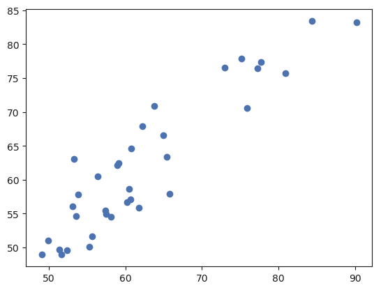


Compute the **mean squared error**:


```python
mean_squared_error(test.Score, pred)
```


    17.15400732386189


We try to use a **linear mixed model**, considering as random effects the Region variable.


```python
md = smf.mixedlm("Score ~ PropertyRights + LaborFreedom + FiscalHealth", train, groups="Region")
mdf = md.fit()
mdf.summary()
```


<table class="simpletable">
<tr>
       <td>Model:</td>       <td>MixedLM</td> <td>Dependent Variable:</td>   <td>Score</td>  
</tr>
<tr>
  <td>No. Observations:</td>   <td>138</td>         <td>Method:</td>         <td>REML</td>   
</tr>
<tr>
     <td>No. Groups:</td>       <td>5</td>          <td>Scale:</td>         <td>11.7894</td> 
</tr>
<tr>
  <td>Min. group size:</td>    <td>12</td>        <td>Likelihood:</td>     <td>-376.7216</td>
</tr>
<tr>
  <td>Max. group size:</td>    <td>34</td>        <td>Converged:</td>         <td>Yes</td>   
</tr>
<tr>
  <td>Mean group size:</td>   <td>27.6</td>            <td></td>               <td></td>     
</tr>
</table>
<table class="simpletable">
<tr>
         <td></td>         <th>Coef.</th> <th>Std.Err.</th>    <th>z</th>   <th>P>|z|</th> <th>[0.025</th> <th>0.975]</th>
</tr>
<tr>
  <th>Intercept</th>      <td>26.215</td>   <td>1.628</td>  <td>16.103</td> <td>0.000</td> <td>23.025</td> <td>29.406</td>
</tr>
<tr>
  <th>PropertyRights</th>  <td>0.402</td>   <td>0.021</td>  <td>18.871</td> <td>0.000</td>  <td>0.361</td>  <td>0.444</td>
</tr>
<tr>
  <th>LaborFreedom</th>    <td>0.102</td>   <td>0.024</td>   <td>4.211</td> <td>0.000</td>  <td>0.055</td>  <td>0.150</td>
</tr>
<tr>
  <th>FiscalHealth</th>    <td>0.114</td>   <td>0.011</td>  <td>10.372</td> <td>0.000</td>  <td>0.092</td>  <td>0.135</td>
</tr>
<tr>
  <th>Region Var</th>      <td>1.455</td>   <td>0.456</td>     <td></td>      <td></td>       <td></td>       <td></td>   
</tr>
</table>


See <http://www.statsmodels.org/stable/index.html> for other commands about the linear (mixed) model. Also, <https://www.statsmodels.org/stable/examples/notebooks/generated/mixed_lm_example.html> makes a comparison between R lmer and Statsmodels MixedLM.

# <span style="color:blue"> Principal Component Analysis </span>

Import packages:


```python
from sklearn.preprocessing import StandardScaler
from sklearn.decomposition import PCA
import numpy as np
```

Standardize data:


```python
features = ['PropertyRights', 'LaborFreedom', 'GovernmentIntegrity', 'JudicalEffectiveness','FiscalHealth']
# Separating out the features
x = dt.loc[:, features].values
# Separating out the target
y = dt.loc[:,'Score'].values
# Standardizing the features
x = StandardScaler().fit_transform(x)
```

Perform PCA considering $2$ principal components:


```python
pca = PCA(4)
projected = pca.fit_transform(x)
```


```python
print(x.shape)
print(projected.shape)
```

    (173L, 5L)
    (173L, 4L)
    

Plot the first $2$ principal components:


```python
plt.scatter(projected[:, 0], projected[:, 1],
            c=y, edgecolor='none', alpha=0.5,
            cmap=plt.cm.get_cmap('seismic', 10))
plt.xlabel('component 1')
plt.ylabel('component 2')
plt.colorbar()
```


    <matplotlib.colorbar.Colorbar at 0x129a2be0>


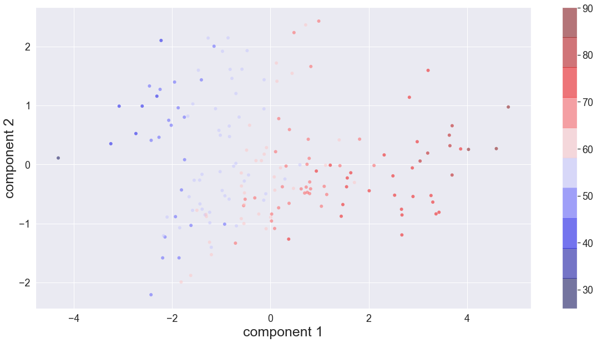


```python
plt.plot(np.cumsum(pca.explained_variance_ratio_)) 
plt.xlabel("Number of component") 
plt.ylabel("Variance explained")
plt.xticks(range(4), [1,2,3,4])
```


    ([<matplotlib.axis.XTick at 0x12ac31d0>,
      <matplotlib.axis.XTick at 0x129e3b38>,
      <matplotlib.axis.XTick at 0x12ab8860>,
      <matplotlib.axis.XTick at 0x12b1a128>],
     <a list of 4 Text xticklabel objects>)


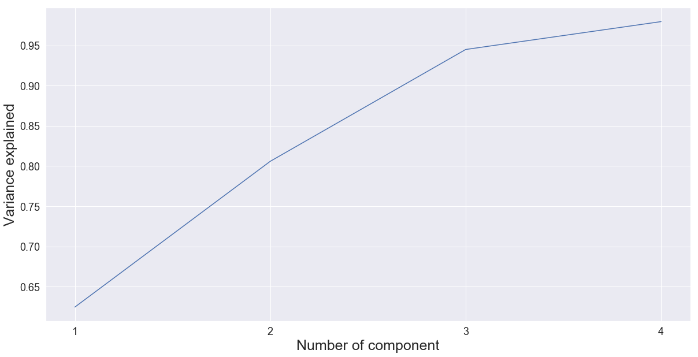

